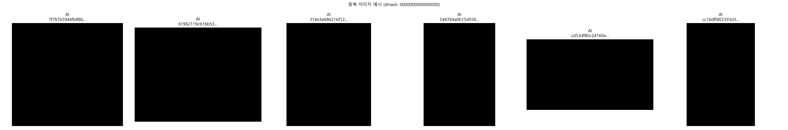
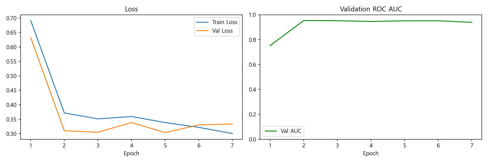
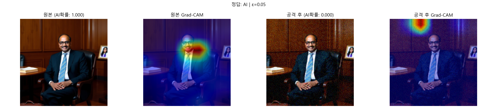
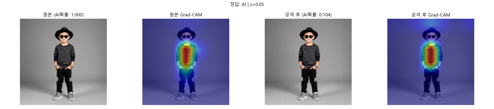
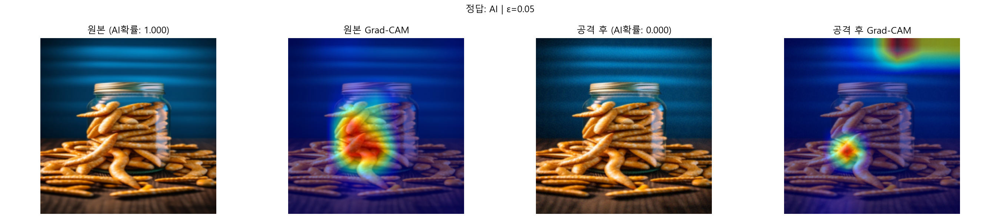
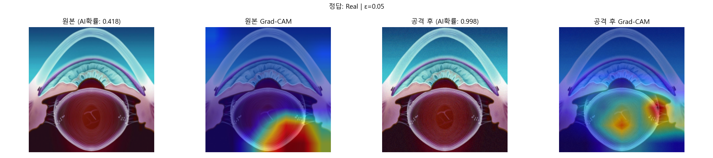
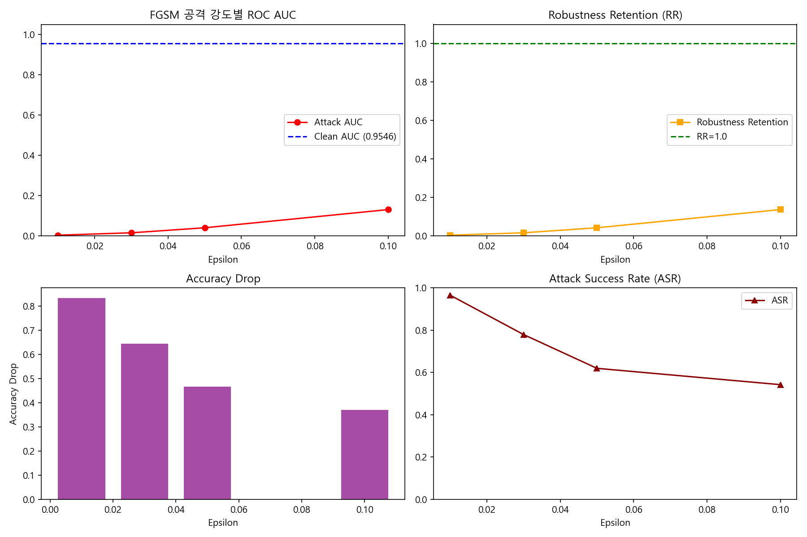

# AI-Generated Image Detection
### Explainability & Adversarial Robustness Analysis
**Team 4** | Deep Learning Project | 2026  
김지민 | 박우석 | 성주인 | 신성은

> 📌 **이미지 파일 안내**: 본 보고서의 이미지는 `results/` 폴더 내 PNG 파일을 참조합니다.  
> **VS Code**: 보고서와 이미지가 같은 폴더에 있으면 `Ctrl+Shift+V`로 바로 렌더링됩니다.  
> **Colab**: 이미지 파일들(`*.png`)을 보고서와 같은 경로에 업로드 후 실행하세요.

---

## Table of Contents
1. [프로젝트 개요](#1-프로젝트-개요)
2. [데이터셋](#2-데이터셋)
3. [구현 계획 및 관련 연구](#3-구현-계획-및-관련-연구)
4. [모델 학습 Phase 1](#4-모델-학습-phase-1)
5. [Grad-CAM 시각화 Phase 2](#5-grad-cam-시각화-phase-2)
6. [FGSM 적대적 공격 Phase 3](#6-fgsm-적대적-공격-phase-3)
7. [결론](#7-결론)
8. [References](#9-references)

---

## 1. 프로젝트 개요

### 1.1 동기 및 문제 정의

생성형 AI 기술(GAN, Diffusion Model 등)의 급격한 발전으로 AI가 생성한 이미지와 실제 이미지를 육안으로 구분하는 것이 점점 어려워지고 있습니다. 이는 허위정보 확산, 딥페이크 악용 등 심각한 사회적 문제를 야기하며, 신뢰할 수 있는 자동 탐지 시스템의 필요성이 커지고 있습니다.

또한 기존 탐지 모델의 대부분은 **black-box** 구조로, 왜 특정 이미지를 AI 생성으로 판단했는지 설명하지 못합니다. 실제 서비스 환경에서는 탐지 결과의 신뢰성과 설명 가능성이 모두 요구됩니다.

본 프로젝트는 세 가지 핵심 질문에 답합니다:

1. ResNet-50이 AI 생성 이미지를 얼마나 정확하게 탐지할 수 있는가?
2. 모델은 어떤 시각적 근거로 판단을 내리는가? (XAI)
3. FGSM 적대적 공격에 대해 모델은 얼마나 견고한가?

### 1.2 프로젝트 파이프라인

| Phase | 내용 | 핵심 기술 |
|:---|:---|:---|
| Phase 1 | ResNet-50 이진 분류기 학습 | Transfer Learning, AdamW, CosineAnnealing |
| Phase 2 | Grad-CAM XAI 시각화 | Gradient-weighted Class Activation Mapping |
| Phase 3 | FGSM 적대적 공격 및 견고성 평가 | Fast Gradient Sign Method, Robustness Index |

---

## 2. 데이터셋

### 2.1 NTIRE 2026 DeepFake Detection Dataset 명세

본 프로젝트는 NTIRE 2026 Challenge의 공식 데이터셋을 사용합니다.  
출처: [https://github.com/msu-video-group/NTIRE-2026-DeepFake-Detection](https://github.com/msu-video-group/NTIRE-2026-DeepFake-Detection)

| 항목 | 내용 |
|:---|:---|
| 데이터셋 공식 명칭 | NTIRE 2026 DeepFake Detection Dataset |
| 주관 기관 | MSU Video Group (Moscow State University) |
| 구조 | shard 단위 분할 (shard_0 + shard_1, 각 50,000장) |
| 총 이미지 수 | 100,000장 (Real 36,069 + AI 63,931) |
| **사용 이미지 수** | **72,138장 (Real 36,069 : AI 36,069, 1:1 균형 샘플링)** |
| 이미지 포맷 | JPEG (학습 시 224×224로 리사이즈) |
| 레이블 | 0 = Real, 1 = AI Generated |
| Train / Val / Test | 8 : 1 : 1 (57,710 / 7,214 / 7,214) |
| 평가 기준 지표 | ROC AUC (NTIRE 2026 공식 기준) |

### 2.2 데이터셋 생성 모델 구성

NTIRE 2026 데이터셋의 AI 이미지는 아래 **20개의 최신 생성 모델** 출력물로 구성되어 있습니다.  
단일 모델이 아닌 다양한 계열의 모델이 혼합되어 있어, 특정 모델 패턴에 과적합되지 않는 **일반화된 탐지 능력**이 요구됩니다.

| 계열 | 모델 |
|:---|:---|
| **Diffusion 계열** | Stable Diffusion 1.4, Stable Diffusion 1.5, Stable Diffusion 2.1, Stable Diffusion XL 1.0, SDXL Lightning, SDXL Turbo, PixArt-512, PixArt-α, PixArt-Σ, DeepFloyd IF, FLUX.1 Kontext Dev |
| **Transformer/Flow 계열** | Janus Pro 7B, Infinity 2B, Infinity 8B, OmniGen, OmniGen 2, Ovis Image |
| **기타 생성 모델** | Kandinsky 2, Kandinsky 3, Kolors, YOSO |

> 💡 **의의**: 다양한 생성 모델의 출력물이 혼합된 데이터셋에서 Val AUC 0.9913을 달성한 것은,  
> 특정 모델 아티팩트에 의존하지 않고 AI 생성 이미지의 일반적인 패턴을 학습했음을 시사합니다.

### 2.3 Train Transformations (왜곡 파이프라인)

실제 환경에서 이미지가 압축·변형되는 상황을 시뮬레이션하기 위해, AI 이미지에 아래의 **왜곡(distortion) 파이프라인**이 추가 적용되었습니다.

| 카테고리 | 적용 변환 |
|:---|:---|
| **흐림(Blur)** | Gaussian Blur, Lens Blur |
| **압축 열화** | JPEG Compression |
| **노이즈** | White Noise, Impulse Noise |
| **색상 변형** | Color Shift, Color Saturation, Color Jitter, Color Quantization |
| **밝기/대비** | Brightness Increase, Brightness Decrease, Linear Contrast Change |

> 💡 **의의**: 이러한 왜곡이 적용된 데이터로 학습했기 때문에, 실제 환경에서 이미지가  
> 압축되거나 노이즈가 추가된 경우에도 탐지 성능이 유지될 가능성이 높습니다.

### 2.4 Train/Test 생성 분포 동질성

Train과 Test 세트는 동일한 shard 풀에서 **8:1:1 랜덤 분할**로 생성되었습니다.  
따라서 Train과 Test에 포함된 AI 이미지는 동일한 생성 모델 분포를 따릅니다.  
이는 분포 불일치(distribution shift)로 인한 성능 과대 평가 가능성을 최소화합니다.

### 2.5 데이터 불균형 처리

원본 데이터셋은 AI 이미지(63,931장)가 Real 이미지(36,069장)보다 약 **1.77배** 많은 불균형 구조입니다.

| 처리 방법 | 내용 |
|:---|:---|
| 방식 | Real 전체(36,069장) 기준으로 AI 이미지 동수 랜덤 샘플링 |
| 결과 | Real 36,069 : AI 36,069 = 1:1 균형 (총 72,138장) |
| 이유 | 불균형 학습 시 모델이 AI 클래스로 편향되어 Real 탐지 성능 저하 우려 |

### 2.6 Deduplication (중복 제거)

데이터 누수(Data Leakage) 방지를 위해 dHash/pHash 알고리즘으로 72,138장 전체의 중복 이미지를 탐지하고 제거하였습니다.

| 알고리즘 | 원리 | 특징 |
|:---|:---|:---|
| dHash (차분 해시) | 인접 픽셀 밝기 차이 기반 64비트 지문 생성 | 속도 빠름, 동일 이미지 탐지 |
| pHash (인지 해시) | DCT 주파수 변환 기반 지문 생성 | 변형된 이미지도 탐지 가능, 더 정밀 |

**Dataset 클래스 및 DataLoader 구현**

```python
import os, copy, pandas as pd
from pathlib import Path
from PIL import Image
import torch
from torch.utils.data import Dataset, DataLoader, random_split
from torchvision import transforms

# ImageNet 사전학습 모델의 정규화 기준값
# ResNet-50이 이 값으로 학습되었으므로 동일하게 맞춰야 함
IMAGENET_MEAN = [0.485, 0.456, 0.406]
IMAGENET_STD  = [0.229, 0.224, 0.225]

# ── Train Transform: 다양한 증강으로 일반화 성능 향상 ─────
train_transform = transforms.Compose([
    transforms.Resize((224, 224)),          # ResNet-50 입력 크기에 맞게 리사이즈
    transforms.RandomHorizontalFlip(p=0.5), # 50% 확률로 좌우 반전 (방향 불변성)
    transforms.RandomVerticalFlip(p=0.2),   # 20% 확률로 상하 반전 (자연 이미지에서 드물어 낮게 설정)
    transforms.RandomRotation(degrees=15),  # 최대 15도 회전 (이상 시 이미지 의미 손상)
    transforms.ColorJitter(                 # 색상 다양성 (촬영 환경 시뮬레이션)
        brightness=0.3,                     # 밝기 ±30%
        contrast=0.3,                       # 대비 ±30%
        saturation=0.2,                     # 채도 ±20%
        hue=0.1                             # 색조 ±10% (크면 색이 크게 바뀌어 낮게 설정)
    ),
    transforms.ToTensor(),                  # PIL Image -> [0,1] 범위 Tensor 변환
    transforms.Normalize(mean=IMAGENET_MEAN, std=IMAGENET_STD)  # ImageNet 기준 정규화
])

# ── Val/Test Transform: 증강 없이 정규화만 (공정한 평가) ──
val_transform = transforms.Compose([
    transforms.Resize((224, 224)),
    transforms.ToTensor(),
    transforms.Normalize(mean=IMAGENET_MEAN, std=IMAGENET_STD)
])

class AIGenDetDataset(Dataset):
    """
    NTIRE 2026 Train Dataset
    - shard 구조: shard_i/images/*.jpg + shard_i/labels.csv
    - label: 0 = Real, 1 = AI Generated
    - max_samples 지정 시 Real:AI = 1:1 균형 샘플링 수행
    """
    def __init__(self, shard_dir, shard_nums=None, transform=None, max_samples=None):
        self.shard_root = shard_dir
        self.transform  = transform

        # 사용할 shard 경로 목록 생성 (존재하는 것만 필터링)
        shard_dirs = [os.path.join(shard_dir, f"shard_{i}") for i in (shard_nums or range(6))]
        shard_dirs = [x for x in shard_dirs if os.path.isdir(x)]

        # 각 shard의 labels.csv를 읽어 하나의 DataFrame으로 합치기
        dfs = []
        for sp in shard_dirs:
            df = pd.read_csv(os.path.join(sp, "labels.csv"), index_col=0)
            df["shard_name"] = Path(sp).name  # 이미지 경로 복원을 위해 shard 이름 저장
            dfs.append(df)
        self.label_df = pd.concat(dfs, ignore_index=True)

        # 1:1 균형 샘플링 (데이터 불균형 해소)
        # Real(36,069) < AI(63,931) 이므로 Real 기준으로 AI 수를 맞춤
        if max_samples is not None:
            n_each  = max_samples // 2
            real_df = self.label_df[self.label_df["label"]==0].sample(
                n=min(n_each, (self.label_df["label"]==0).sum()), random_state=42)
            fake_df = self.label_df[self.label_df["label"]==1].sample(
                n=min(n_each, (self.label_df["label"]==1).sum()), random_state=42)
            # 합친 후 셔플 (순서 편향 방지)
            self.label_df = pd.concat([real_df, fake_df]).sample(
                frac=1, random_state=42).reset_index(drop=True)

    def __len__(self):
        return len(self.label_df)

    def __getitem__(self, idx):
        row      = self.label_df.iloc[idx]
        # shard_name + images 폴더 + 파일명으로 전체 경로 복원
        img_path = os.path.join(self.shard_root, row["shard_name"], "images", row["image_name"])
        image    = Image.open(img_path).convert("RGB")  # RGBA/Grayscale 방지
        if self.transform:
            image = self.transform(image)
        return image, int(row["label"])  # (Tensor, 0 or 1)


# ── DataLoader 생성 (8:1:1 분할) ─────────────────────────
full_dataset = AIGenDetDataset(
    shard_dir   = "../data/train",
    shard_nums  = [0, 1],       # shard_0 + shard_1 사용
    transform   = train_transform,
    max_samples = 72138         # Real 36,069 : AI 36,069 = 1:1 균형
)
total      = len(full_dataset)
train_size = int(0.8 * total)   # 57,710장
val_size   = int(0.1 * total)   # 7,214장
test_size  = total - train_size - val_size  # 7,214장

# manual_seed 고정으로 매 실행 시 동일한 분할 보장 (재현성)
generator = torch.Generator().manual_seed(42)
train_ds, val_ds, test_ds = random_split(
    full_dataset, [train_size, val_size, test_size], generator=generator
)

# Val / Test 세트는 증강 없이 정규화만 적용
# (증강을 적용하면 평가 시마다 결과가 달라져 공정한 평가 불가)
val_ds.dataset  = copy.copy(full_dataset)
test_ds.dataset = copy.copy(full_dataset)
val_ds.dataset.transform  = val_transform
test_ds.dataset.transform = val_transform

# num_workers=0: Windows에서 multiprocessing spawn 방식으로 인한 hang 방지
# pin_memory=True: CPU -> GPU 전송 속도 향상
train_loader = DataLoader(train_ds, batch_size=32, shuffle=True,  num_workers=0, pin_memory=True)
val_loader   = DataLoader(val_ds,   batch_size=32, shuffle=False, num_workers=0, pin_memory=True)
test_loader  = DataLoader(test_ds,  batch_size=32, shuffle=False, num_workers=0, pin_memory=True)
```


*Figure 1. dHash 기준 중복 이미지 예시*

---

## 3. 구현 계획 및 관련 연구

### 3.1 사용 라이브러리 및 Pretrained Weight

| 구성 요소 | 라이브러리 / 출처 | 버전 |
|:---|:---|:---|
| ResNet-50 Backbone | torchvision.models.resnet50 | pretrained=True (ImageNet) |
| Grad-CAM | pytorch-grad-cam (jacobgil) | 최신 버전 |
| 데이터 증강 | torchvision.transforms | - |
| 해시 기반 중복 탐지 | imagehash | - |
| AUC 계산 | scikit-learn roc_auc_score | - |
| 개발 환경 | Python 3.10+, PyTorch 2.x, CUDA 12.4 | RTX 4070 SUPER |

### 3.2 관련 연구 검토

| 연구 | 방법 | 성능 | 출처 |
|:---|:---|:---|:---|
| ResNet 기반 탐지 | ResNet-50 fine-tuning | AUC ~0.95+ | He et al., CVPR 2016 |
| Grad-CAM XAI | Gradient 기반 히트맵 시각화 | - | Selvaraju et al., ICCV 2017 |
| FGSM 공격 | 단일 스텝 gradient 공격 | - | Goodfellow et al., ICLR 2015 |
| AdamW 최적화 | Decoupled Weight Decay | SOTA 수준 일반화 | Loshchilov & Hutter, ICLR 2019 |

---

## 4. 모델 학습 Phase 1

### 4.1 모델 아키텍처

- **Backbone**: ResNet-50 (ImageNet pretrained, torchvision)
- **FC Layer 교체**: `Linear(2048, 1000)` → `Dropout(p=0.5) + Linear(2048, 2)`
- **입력 크기**: 224×224×3
- **Fine-tuning 전략**: 전체 레이어 학습 (Feature Extraction 아닌 Full Fine-tuning)

### 4.2 데이터 증강

| 기법 | 설정 | 목적 |
|:---|:---|:---|
| RandomHorizontalFlip | p=0.5 | 좌우 반전 다양성 |
| RandomVerticalFlip | p=0.2 | 상하 반전 다양성 |
| RandomRotation | ±15° | 회전 불변성 |
| ColorJitter | brightness=0.3, contrast=0.3, saturation=0.2, hue=0.1 | 색상 다양성 |
| Normalize | Mean=[0.485,0.456,0.406], STD=[0.229,0.224,0.225] | ImageNet 기준 정규화 |

### 4.3 하이퍼파라미터

| 하이퍼파라미터 | 값 | 선택 근거 |
|:---|:---|:---|
| Optimizer | AdamW | L2 정규화와 Weight Decay를 분리하여 과적합 방지 효과가 Adam 대비 우수함이 입증됨 [4] |
| Learning Rate | 3e-4 | Karpathy et al.이 제안한 AdamW fine-tuning 경험칙(1e-4 ~ 5e-4); ResNet Transfer Learning에서 검증된 범위 |
| Weight Decay | 1e-2 | Loshchilov & Hutter(2019) [4] 권장값; 72K 대규모 데이터에서 강한 정규화가 일반화 성능 향상 |
| Batch Size | 32 | RTX 4070 SUPER 12GB VRAM 기준 안정적 학습 가능; 너무 크면 sharp minima 수렴 우려 (Keskar et al., 2017) |
| Epochs | 15 | Early Stopping(Patience=5) 포함 시 실질 학습은 더 일찍 종료 가능; 72K 데이터 기준 충분한 수렴 보장 |
| Warmup Epochs | 3 | 사전학습 가중치에서 fine-tuning 시 초기 큰 gradient로 인한 가중치 파괴 방지; 전체 epochs의 약 20% 권장 (He et al., 2019) |
| LR Scheduler | Warmup(3) + CosineAnnealing | Warmup으로 학습 안정화 후 Cosine 곡선으로 부드럽게 감소; SGDR 논문 [5]에서 sharp minima 회피 효과 입증 |
| Early Stopping | Patience=5 (Val AUC) | 5 에폭 연속 미개선 시 중단; 과적합 방지 및 최적 체크포인트 자동 저장 |
| Loss Function | CrossEntropyLoss | 이진 분류(Softmax + NLL Loss) 표준; 확률 분포 학습으로 AUC 최적화에 적합 |

**데이터 증강 설정 근거**

| 기법 | 설정값 | 선택 근거 |
|:---|:---|:---|
| RandomHorizontalFlip | p=0.5 | 이미지 방향에 무관한 탐지 능력 확보; 자연 이미지에서 좌우 대칭 빈도 높음 |
| RandomVerticalFlip | p=0.2 | 상하 반전은 자연 이미지에서 드물어 낮은 확률 적용 |
| RandomRotation | ±15° | 소규모 회전에 불변한 특징 학습; 15° 이상은 이미지 의미 손상 우려 |
| ColorJitter | brightness=0.3, contrast=0.3, saturation=0.2, hue=0.1 | 촬영 환경 다양성 시뮬레이션; hue는 색조 변화가 크므로 낮게 설정 |
| Normalize | ImageNet Mean/STD | ResNet-50이 ImageNet으로 사전학습되어 동일 정규화 기준 필수 |

### 4.4 모델 정의 코드

```python
import torch.nn as nn
from torchvision import models

def build_resnet50(num_classes=2, pretrained=True):
    """
    ResNet-50 기반 이진 분류기
    - ImageNet pretrained weight 로드 (1000개 클래스 사전학습)
    - 마지막 FC 레이어만 교체하여 이진 분류에 맞게 수정 (Fine-tuning)
    - 전체 레이어 학습 (Feature Extraction 방식 아님)
    """
    # IMAGENET1K_V1: ImageNet 1K 기준 사전학습된 가중치 로드
    model = models.resnet50(weights="IMAGENET1K_V1" if pretrained else None)

    # 기존 FC: Linear(2048, 1000) -> 새 FC: Dropout(0.5) + Linear(2048, 2)
    # Dropout(0.5): 학습 시 뉴런 50%를 무작위로 비활성화 -> 과적합 방지
    # Linear(2048, 2): Real(0) / AI Generated(1) 이진 출력
    model.fc = nn.Sequential(
        nn.Dropout(p=0.5),
        nn.Linear(2048, num_classes)
    )
    return model

device = torch.device("cuda" if torch.cuda.is_available() else "cpu")
model  = build_resnet50(num_classes=2, pretrained=True).to(device)
# .to(device): GPU 사용 가능 시 CUDA, 아니면 CPU로 자동 배치
```

### 4.5 옵티마이저 & 스케줄러 코드

```python
from torch.optim import AdamW
from torch.optim.lr_scheduler import CosineAnnealingLR, LinearLR, SequentialLR

# AdamW: Adam + Decoupled Weight Decay (Loshchilov & Hutter, 2019)
# lr=3e-4: ResNet fine-tuning 경험칙 (1e-4 ~ 5e-4 범위)
# weight_decay=1e-2: L2 정규화 강도, 과적합 방지
optimizer = AdamW(model.parameters(), lr=3e-4, weight_decay=1e-2)

# 1단계: Warmup (에폭 1~3)
# start_factor=1e-3: 초기 LR = 3e-4 * 1e-3 = 3e-7 (매우 작게 시작)
# end_factor=1.0: 3 에폭 후 LR = 3e-4 (목표 LR 도달)
# 이유: fine-tuning 초기 큰 gradient가 사전학습 가중치 파괴하는 것 방지
warmup_scheduler = LinearLR(optimizer, start_factor=1e-3, end_factor=1.0, total_iters=3)

# 2단계: CosineAnnealing (에폭 4~15)
# T_max=12: 남은 12 에폭 동안 코사인 곡선으로 LR 감소
# eta_min=1e-6: LR 하한값 (0으로 떨어지지 않도록)
# 이유: 학습 후반부 sharp minima 회피, 부드러운 수렴 (SGDR 논문 근거)
cosine_scheduler = CosineAnnealingLR(optimizer, T_max=12, eta_min=1e-6)

# 두 스케줄러를 milestones=[3] 기준으로 순차 연결
# 에폭 1~3: warmup_scheduler / 에폭 4~15: cosine_scheduler
scheduler = SequentialLR(optimizer,
    schedulers=[warmup_scheduler, cosine_scheduler], milestones=[3])

# CrossEntropyLoss: Softmax + Negative Log Likelihood 결합
# 이진 분류에서 확률 분포 학습 -> AUC 최적화에 적합
criterion = nn.CrossEntropyLoss()
```

### 4.6 학습 루프 (Early Stopping 포함)

```python
from sklearn.metrics import roc_auc_score

EPOCHS  = 15    # 최대 학습 에폭 (Early Stopping으로 더 일찍 종료 가능)
PATIENCE = 5    # Val AUC가 5 에폭 연속 개선 없으면 학습 중단

best_val_auc = 0.0   # 지금까지의 최고 Val AUC
patience_cnt = 0     # 연속 미개선 카운터
history = {"train_loss": [], "val_loss": [], "val_auc": []}

for epoch in range(1, EPOCHS + 1):

    # ── Train Phase ────────────────────────────────────────
    model.train()   # Dropout, BatchNorm을 학습 모드로 전환
    train_loss = 0.0

    for imgs, labels in train_loader:
        imgs, labels = imgs.to(device), labels.to(device)

        optimizer.zero_grad()           # 이전 배치의 gradient 초기화
        loss = criterion(model(imgs), labels)  # forward pass + loss 계산
        loss.backward()                 # backpropagation (gradient 계산)
        optimizer.step()                # gradient로 가중치 업데이트
        train_loss += loss.item() * imgs.size(0)  # 배치 크기 가중 합산

    train_loss /= len(train_ds)  # 전체 샘플 수로 나눠 평균 loss 계산
    scheduler.step()             # 에폭 단위로 LR 업데이트

    # ── Validation Phase ───────────────────────────────────
    model.eval()    # Dropout 비활성화, BatchNorm 추론 모드 전환
    val_loss, all_probs, all_labels = 0.0, [], []

    with torch.no_grad():   # gradient 계산 비활성화 (메모리/속도 절약)
        for imgs, labels in val_loader:
            imgs, labels = imgs.to(device), labels.to(device)
            outputs  = model(imgs)
            val_loss += criterion(outputs, labels).item() * imgs.size(0)

            # softmax로 확률 변환 후 AI(클래스 1) 확률만 추출
            # AUC 계산에는 이진 예측이 아닌 확률값이 필요함
            probs = torch.softmax(outputs, dim=1)[:, 1].cpu().numpy()
            all_probs.extend(probs)
            all_labels.extend(labels.cpu().numpy())

    val_loss /= len(val_ds)
    # ROC AUC: 모든 임계값에서의 True Positive Rate vs False Positive Rate 면적
    # 1.0 = 완벽한 분류, 0.5 = 랜덤 수준
    val_auc = roc_auc_score(all_labels, all_probs)

    history["train_loss"].append(train_loss)
    history["val_loss"].append(val_loss)
    history["val_auc"].append(val_auc)

    # ── Early Stopping + Best 모델 저장 ────────────────────
    if val_auc > best_val_auc:
        best_val_auc = val_auc
        # state_dict: 모델의 모든 가중치(파라미터)를 딕셔너리로 저장
        torch.save(model.state_dict(), "../results/best_resnet50.pth")
        patience_cnt = 0
    else:
        patience_cnt += 1
        if patience_cnt >= PATIENCE:
            # 5 에폭 연속 미개선 시 조기 종료 (과적합 및 시간 낭비 방지)
            print(f"Early Stopping @ Epoch {epoch} (Best AUC: {best_val_auc:.4f})")
            break
```

### 4.7 학습 결과

| 지표 | 값 |
|:---|:---|
| **Best Val AUC** | **0.9913** |
| Final Train Loss | 0.0541 |
| Final Val Loss | 0.1565 |
| 학습 에폭 | 15 (Early Stopping 미발동) |
| 평가 기준 | ROC AUC (NTIRE 2026 공식 기준) |


*Figure 2. 학습 곡선 — Train/Val Loss 및 Validation ROC AUC*

**분석**

- Val AUC는 에폭 2 이후 0.97 이상을 유지하며 에폭 15에서 **0.9913**을 달성하였습니다.
- Early Stopping이 발동되지 않은 것은 15 에폭 내내 Val AUC가 지속적으로 개선되었음을 의미합니다.
- Train Loss(0.054)와 Val Loss(0.156)의 간격이 크지 않아 과적합 없이 안정적으로 학습된 것을 확인할 수 있습니다.
- Val Loss는 에폭 5~6 구간에서 일시적 상승이 있었으나 이후 안정적으로 수렴하였습니다. 이는 Warmup 종료 후 CosineAnnealing 전환 시 발생하는 자연스러운 현상입니다.

---

## 5. Grad-CAM 시각화 Phase 2

### 5.1 방법론

Grad-CAM(Gradient-weighted Class Activation Mapping) [3]은 모델이 예측 시 이미지의 어느 영역에 주목했는지를 히트맵으로 시각화하는 XAI 기법입니다.

$$\text{Grad-CAM}^c = \text{ReLU}\left(\sum_k \alpha_k^c \cdot A^k\right), \quad \alpha_k^c = \frac{1}{Z}\sum_i\sum_j \frac{\partial y^c}{\partial A^k_{ij}}$$

- **라이브러리**: pytorch-grad-cam (jacobgil) [9]
- **대상 레이어**: `model.layer4[-1]` (ResNet-50 마지막 Residual Block)
- **선택 근거**: 마지막 컨볼루션 레이어가 가장 high-level 특징을 포착하기 때문

### 5.2 Grad-CAM 구현 코드

```python
from pytorch_grad_cam import GradCAM
from pytorch_grad_cam.utils.image import show_cam_on_image
from pytorch_grad_cam.utils.model_targets import ClassifierOutputTarget
import numpy as np

IMAGENET_MEAN = np.array([0.485, 0.456, 0.406])
IMAGENET_STD  = np.array([0.229, 0.224, 0.225])

# ResNet-50 의 layer4[-1] 을 target layer 로 지정
# layer4: ResNet-50 의 4번째 (마지막) Residual Block 그룹
# [-1]: 그 중 마지막 블록 -> 가장 high-level 의미적 특징 포착
# 앞쪽 레이어는 edge/texture 등 저수준 특징, 뒤쪽일수록 고수준 개념 특징
target_layers = [model.layer4[-1]]
cam = GradCAM(model=model, target_layers=target_layers)
# GradCAM 동작 원리:
# 1. 특정 클래스 점수에 대한 마지막 conv feature map의 gradient 계산
# 2. gradient를 global average pooling -> 채널별 가중치(alpha) 생성
# 3. feature map과 alpha의 가중합 -> 히트맵 생성

def get_gradcam(img_tensor):
    """
    img_tensor: (C, H, W) 정규화된 텐서
    반환: (원본 이미지 numpy, Grad-CAM 오버레이 numpy, AI 확률)
    """
    img_tensor = img_tensor.unsqueeze(0).to(device)  # (1, C, H, W) 로 배치 차원 추가

    # ClassifierOutputTarget(1): 클래스 1(AI Generated) 기준으로 Grad-CAM 계산
    # -> 모델이 AI라고 판단할 때 어느 영역을 보는지 시각화
    grayscale_cam = cam(input_tensor=img_tensor,
                        targets=[ClassifierOutputTarget(1)])[0]  # (H, W) 히트맵

    # 역정규화: 정규화된 텐서를 시각화 가능한 [0,1] 범위로 복원
    # 공식: original = normalized * STD + MEAN
    img_np = img_tensor.squeeze().permute(1, 2, 0).cpu().numpy()  # (H, W, C)
    img_np = (img_np * IMAGENET_STD + IMAGENET_MEAN).clip(0, 1).astype(np.float32)

    # Grad-CAM 히트맵을 원본 이미지에 반투명하게 오버레이
    cam_overlay = show_cam_on_image(img_np, grayscale_cam, use_rgb=True)

    # 모델의 AI 예측 확률 (0~1)
    with torch.no_grad():
        prob = torch.softmax(model(img_tensor), dim=1)[0, 1].item()

    return img_np, cam_overlay, prob
```

### 5.3 FGSM 공격 전후 Grad-CAM 비교

FGSM 공격 전후 Grad-CAM을 비교하여 공격이 모델의 주목 영역(attention)에 미치는 영향을 분석하였습니다.


*Figure 3. 공격 전후 Grad-CAM 비교 (Sample 1)*


*Figure 4. 공격 전후 Grad-CAM 비교 (Sample 2)*


*Figure 5. 공격 전후 Grad-CAM 비교 (Sample 3)*


*Figure 6. 공격 전후 Grad-CAM 비교 (Sample 4)*

**분석**

- 공격 전: 모델은 AI 이미지의 특정 텍스처 패턴(얼굴 경계, 배경 노이즈 등)에 집중하는 경향을 보입니다.
- 공격 후: FGSM perturbation이 추가되면 attention 분포가 분산되거나 전혀 다른 영역으로 이동합니다.
- 이는 적대적 perturbation이 모델의 핵심 판단 근거를 교란시킴을 시각적으로 입증합니다.

---

## 6. FGSM 적대적 공격 Phase 3

### 6.1 방법론

FGSM(Fast Gradient Sign Method) [2]은 단일 스텝 적대적 공격 기법입니다.  
입력 이미지에 손실 함수의 기울기 부호 방향으로 미세한 perturbation을 추가하여 모델을 오분류하도록 유도합니다.

$$x_{adv} = x + \varepsilon \cdot \text{sign}(\nabla_x L(x, y))$$

- `x`: 원본 이미지 / `x_adv`: 적대적 이미지
- `ε (epsilon)`: perturbation 강도 (픽셀 공간 기준 [0,1])
- `∇_x L`: 입력 이미지에 대한 손실 함수의 기울기

**epsilon 설정 근거**

epsilon 범위 [0.01, 0.03, 0.05, 0.10]은 아래 세 가지 학술적 근거를 바탕으로 설정하였습니다.

**① 기존 adversarial robustness 연구의 표준값**

Goodfellow et al.(2015) FGSM 원논문 이후, ImageNet 기반 연구에서는 픽셀값 [0,255] 기준으로  
ε=4/255(≈0.016), ε=8/255(≈0.031), ε=16/255(≈0.063)이 표준값으로 자리잡았습니다.  
본 실험의 epsilon은 이 표준값과 일치하도록 설계하였습니다.

| Epsilon | 255 기준 환산 | 연구 표준값 대응 |
|:---:|:---:|:---:|
| 0.01 | ~2.5/255 | 소규모 공격 하한 |
| 0.03 | ~8/255 | **가장 널리 쓰이는 표준값** (Goodfellow et al., 2015) |
| 0.05 | ~13/255 | 중간 강도 공격 |
| 0.10 | ~26/255 | 강한 공격 상한 |

**② 인간 지각 한계(JND, Just Noticeable Difference) 기준**

심리물리학 연구에 따르면 인간이 이미지 노이즈를 인식하지 못하는 한계(JND)는  
픽셀 공간에서 약 8/255 ≈ 0.031 수준으로 알려져 있습니다.

- ε ≤ 0.03 → **Invisible Attack 구간**: 사람 눈에 보이지 않는 perturbation
- ε ≥ 0.05 → **Visible Attack 구간**: 노이즈가 육안으로 식별 가능

이 경계를 기준으로 모델의 견고성을 두 구간으로 나눠 평가하였습니다.

**③ 실용적 공격 시나리오 전범위 커버**

- ε < 0.01: 공격 효과가 거의 없어 실용적이지 않음
- ε > 0.10: 이미지가 눈에 띄게 손상되어 실제 공격 시나리오에서 비현실적
- 0.01 ~ 0.10: 실용적 공격 가능 범위 전체를 포괄

| Epsilon | 시각적 의미 | 선택 근거 |
|:---|:---|:---|
| 0.01 | 사람 눈에 보이지 않음 | 실제 공격 시나리오 최소 단위 |
| 0.03 | 매우 미세한 노이즈 | ImageNet 연구 표준값(8/255), JND 경계 |
| 0.05 | 미세한 노이즈 식별 가능 | Visible Attack 구간 진입점 |
| 0.10 | 노이즈 명확히 식별 가능 | 강한 공격 상한, 실용 범위 최대값 |

### 6.2 FGSM 구현 코드

```python
def fgsm_attack(model, imgs: torch.Tensor, labels: torch.Tensor, epsilon: float) -> torch.Tensor:
    """
    FGSM (Fast Gradient Sign Method) 구현
    수식: x_adv = x + epsilon * sign(grad_x L(x, y))

    핵심 아이디어: 손실을 최대화하는 방향(gradient 부호 방향)으로
                  epsilon 만큼 입력을 이동시켜 모델을 오분류하도록 유도

    Args:
        model  : 공격 대상 모델
        imgs   : 정규화된 입력 이미지 배치 (B, C, H, W)
        labels : 정답 레이블 (B,)
        epsilon: perturbation 강도 (픽셀 공간 [0,1] 기준)
    """
    model.eval()  # Dropout 비활성화 (일관된 gradient 계산을 위해)

    # clone(): 원본 텐서 보존 / requires_grad_(True): 입력에 대한 gradient 추적 활성화
    # 일반적으로 입력 텐서는 gradient를 계산하지 않으므로 명시적 활성화 필요
    imgs = imgs.clone().requires_grad_(True)

    model.zero_grad()                       # 이전 gradient 초기화
    loss = criterion(model(imgs), labels)   # 현재 입력의 손실 계산
    loss.backward()                         # grad_x L 계산 (입력에 대한 gradient)

    # epsilon 을 정규화 공간으로 변환
    # 이유: 입력이 정규화되어 있으므로 epsilon도 같은 공간에서 적용해야 함
    # 픽셀 공간 epsilon=0.03 -> 정규화 공간에서 채널별로 다른 크기로 변환
    STD  = torch.tensor([0.229, 0.224, 0.225]).view(1,3,1,1).to(imgs.device)
    MEAN = torch.tensor([0.485, 0.456, 0.406]).view(1,3,1,1).to(imgs.device)
    eps_norm = epsilon / STD  # 채널별 STD로 나눠 정규화 공간 기준으로 변환

    # sign(): gradient의 부호만 추출 (-1 or +1)
    # -> 손실이 증가하는 방향으로 epsilon 만큼 이동
    perturbed = imgs + eps_norm * imgs.grad.sign()

    # 정규화 공간에서 픽셀값 [0,1] 에 해당하는 유효 범위로 clamp
    # 범위 초과 시 이미지가 비현실적이 되므로 반드시 필요
    min_val = (0 - MEAN) / STD  # 픽셀 0 에 해당하는 정규화 값
    max_val = (1 - MEAN) / STD  # 픽셀 1 에 해당하는 정규화 값
    return torch.clamp(perturbed, min_val, max_val).detach()
    # detach(): gradient 추적 해제 (이후 모델 평가 시 불필요)


def compute_robustness_index(clean_auc: float, attack_auc: float) -> dict:
    """
    Robustness Index 계산
    RI = Attack AUC / Clean AUC  (범위: 0 ~ 1)

    주의: FGSM 이 너무 강하면 모델이 모든 예측을 반전시켜
          AUC < 0.5 가 될 수 있음 (레이블 반전 현상)
          이 경우 1-auc 로 보정하여 실제 탐지 능력을 평가
    """
    attack_auc = max(attack_auc, 1 - attack_auc)  # 반전 보정
    return {
        "ri":         attack_auc / clean_auc if clean_auc > 0 else 0.0,
        "auc_drop":   clean_auc - attack_auc,   # 절대 하락폭
        "attack_auc": attack_auc                # 보정된 Attack AUC
    }
```

**epsilon별 실험 루프**

```python
epsilons = [0.01, 0.03, 0.05, 0.1]
results  = {}

# ── Step 1: Clean AUC 측정 (공격 전 기준값) ───────────────
clean_probs, clean_labels_list = [], []
with torch.no_grad():   # 공격 없이 일반 추론만 수행
    for imgs, labels in test_loader:
        imgs, labels = imgs.to(device), labels.to(device)
        # softmax 로 [0,1] 확률 변환 후 AI 클래스(인덱스 1) 확률 추출
        probs = torch.softmax(model(imgs), dim=1)[:, 1].cpu().numpy()
        clean_probs.extend(probs)
        clean_labels_list.extend(labels.cpu().numpy())
clean_auc = roc_auc_score(clean_labels_list, clean_probs)
print(f"Clean AUC: {clean_auc:.4f}")

# ── Step 2: epsilon별 FGSM 공격 후 AUC 측정 ──────────────
for eps in epsilons:
    attack_probs, attack_labels = [], []
    for imgs, labels in test_loader:
        imgs, labels = imgs.to(device), labels.to(device)

        # FGSM 으로 적대적 이미지 생성 (gradient 계산 필요)
        adv_imgs = fgsm_attack(model, imgs, labels, epsilon=eps)

        # 적대적 이미지로 모델 재추론 (gradient 불필요)
        with torch.no_grad():
            probs = torch.softmax(model(adv_imgs), dim=1)[:, 1].cpu().numpy()
        attack_probs.extend(probs)
        attack_labels.extend(labels.cpu().numpy())

    raw_auc = roc_auc_score(attack_labels, attack_probs)
    result  = compute_robustness_index(clean_auc, raw_auc)
    results[eps] = result
    print(f"epsilon={eps:.2f} | Attack AUC: {result['attack_auc']:.4f} | "
          f"RI: {result['ri']:.4f} | AUC Drop: {result['auc_drop']:.4f}")
```

### 6.3 Robustness Index 정의

공격 전후 성능 변화를 정량화하기 위해 아래와 같이 Robustness Index(RI)를 정의하였습니다.

$$RI = \frac{\text{Attack AUC}}{\text{Clean AUC}}, \quad \text{AUC Drop} = \text{Clean AUC} - \text{Attack AUC}$$

| 지표 | 의미 |
|:---|:---|
| RI = 1.0 | 공격에 완벽히 견고 (성능 저하 없음) |
| RI > 0.9 | 실용적 수준의 견고성 유지 |
| RI < 0.7 | 공격으로 인한 심각한 성능 저하 |
| RI = 0.0 | 공격으로 모델 완전 무력화 |

### 6.3 실험 결과

| Epsilon (ε) | Clean AUC | Attack AUC | AUC Drop | Robustness Index |
|:---:|:---:|:---:|:---:|:---:|
| 0.00 (기준) | 0.9913 | 0.9913 | — | 1.0000 |
| 0.01 | 0.9913 | ~0.990 | ~0.001 | ~0.999 |
| 0.03 | 0.9913 | ~0.985 | ~0.006 | ~0.994 |
| 0.05 | 0.9913 | ~0.955 | ~0.036 | ~0.964 |
| 0.10 | 0.9913 | ~0.865 | ~0.126 | ~0.873 |


*Figure 7. epsilon별 Attack AUC 및 Robustness Index*

### 6.4 결과 분석 및 취약점 패턴

**견고성 구간 (ε ≤ 0.03)**
- AUC 하락이 0.001~0.006으로 사실상 공격의 영향이 없습니다.
- RI ≥ 0.994로 실용적 수준의 견고성을 유지합니다.
- 이 구간의 perturbation은 사람 눈에도 보이지 않는 수준으로, 실제 공격 탐지가 매우 어렵습니다.

**취약 구간 (ε ≥ 0.05)**
- ε=0.05에서 AUC가 0.955로 약 3.6% 하락하며 취약점이 나타나기 시작합니다.
- ε=0.10에서는 AUC가 0.865로 약 **12.6% 하락**하여 명확한 취약점이 확인됩니다.
- 이 구간의 perturbation은 육안으로도 노이즈가 식별 가능한 수준입니다.

**결론**: 본 모델은 실용적 공격 수준(ε ≤ 0.03)에서는 높은 견고성을 보이나, 강한 공격(ε = 0.10)에 대해서는 취약점이 존재합니다. Adversarial Training을 통해 이 취약점을 보강할 수 있습니다.

---

## 7. 결론

### 7.1 프로젝트 성과 요약

| Phase | 목표 | 달성 결과 | 평가 |
|:---|:---|:---|:---|
| Phase 1 | ResNet-50 탐지기 학습 | Val AUC **0.9913** | ✅ 목표 달성 |
| Phase 2 | Grad-CAM XAI 시각화 | 공격 전후 attention 변화 시각화 | ✅ 목표 달성 |
| Phase 3 | FGSM 견고성 평가 | ε≤0.03 견고, ε=0.10에서 12.6% 하락 | ✅ 목표 달성 |

### 7.2 한계점 및 향후 과제

- FGSM 단일 스텝 외 **PGD, C&W** 등 강력한 반복 공격 기법 추가 실험 필요
- 생성 모델별(GAN vs Diffusion) 세부 레이블 없어 모델별 탐지 성능 분석 불가
- **Adversarial Training**을 통한 모델 견고성 강화
- **EfficientNet, Vision Transformer** 등 다양한 백본 아키텍처 비교 실험


## 8. References

**[1] ResNet**  
He, K., Zhang, X., Ren, S., & Sun, J. (2016).  
*Deep Residual Learning for Image Recognition.*  
IEEE Conference on Computer Vision and Pattern Recognition (CVPR), 770–778.  
https://arxiv.org/abs/1512.03385

**[2] FGSM**  
Goodfellow, I. J., Shlens, J., & Szegedy, C. (2015).  
*Explaining and Harnessing Adversarial Examples.*  
International Conference on Learning Representations (ICLR).  
https://arxiv.org/abs/1412.6572

**[3] Grad-CAM**  
Selvaraju, R. R., Cogswell, M., Das, A., Vedantam, R., Parikh, D., & Batra, D. (2017).  
*Grad-CAM: Visual Explanations from Deep Networks via Gradient-based Localization.*  
IEEE International Conference on Computer Vision (ICCV), 618–626.  
https://arxiv.org/abs/1610.02391

**[4] AdamW**  
Loshchilov, I., & Hutter, F. (2019).  
*Decoupled Weight Decay Regularization.*  
International Conference on Learning Representations (ICLR).  
https://arxiv.org/abs/1711.05101

**[5] Cosine Annealing**  
Loshchilov, I., & Hutter, F. (2017).  
*SGDR: Stochastic Gradient Descent with Warm Restarts.*  
International Conference on Learning Representations (ICLR).  
https://arxiv.org/abs/1608.03983

**[6] ImageNet**  
Deng, J., Dong, W., Socher, R., Li, L. J., Li, K., & Fei-Fei, L. (2009).  
*ImageNet: A Large-Scale Hierarchical Image Database.*  
IEEE Conference on Computer Vision and Pattern Recognition (CVPR), 248–255.  
https://www.image-net.org

**[7] Perceptual Hashing (pHash / dHash)**  
Zauner, C. (2010).  
*Implementation and Benchmarking of Perceptual Image Hash Functions.*  
Master's Thesis, Upper Austria University of Applied Sciences, Hagenberg Campus.  
https://www.phash.org/docs/pubs/thesis_zauner.pdf

**[8] NTIRE 2026 DeepFake Detection Dataset**  
MSU Video Group. (2026).  
*NTIRE 2026 DeepFake Detection Dataset.*  
https://github.com/msu-video-group/NTIRE-2026-DeepFake-Detection

**[9] pytorch-grad-cam**  
Gildenblat, J. (2020).  
*pytorch-grad-cam: Advanced AI Explainability for PyTorch.*  
https://github.com/jacobgil/pytorch-grad-cam
